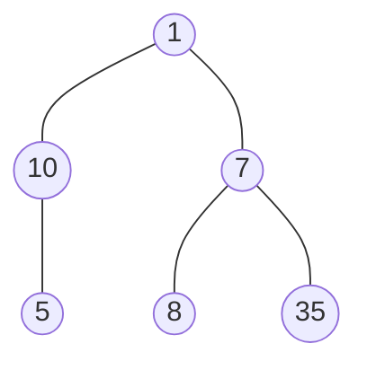
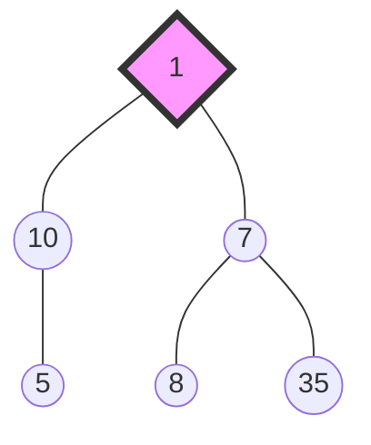
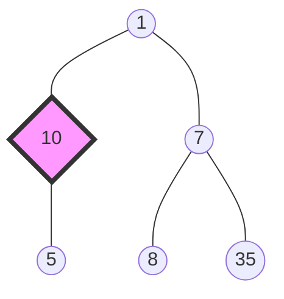
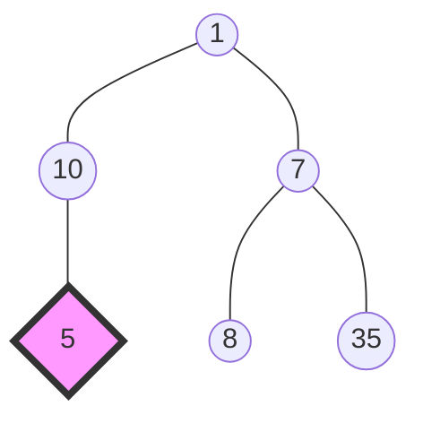
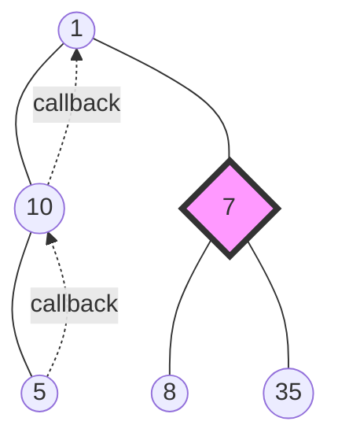
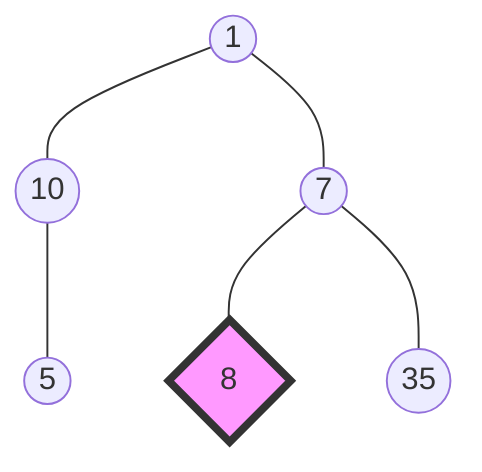
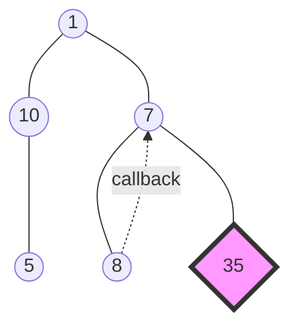
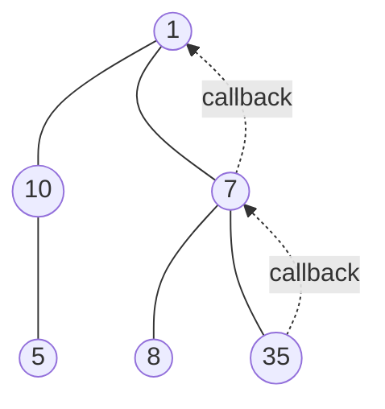
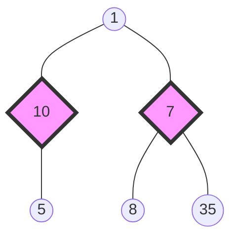
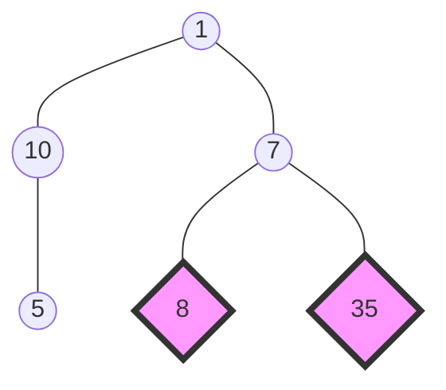

#### 深度优先搜索 - Depth-First-Search - DFS
递归
例：
对于如下二叉树：

[1]

[2]

[3]

[4]

[5]

[6]

[7]



### 广度优先搜索 - Breadth-First Search - BFS
利于队列实现。(队列 FIFO)
先将root node放入队列，
然后取出队列中的一个node，将其子节点放入队列中；
重复以上操作，直到队列为空，则遍历完成。

例：
对于如下二叉树：

进行广度优先搜索：
[1]
根节点 入栈

栈： 1

[2]
栈里的节点出栈，开始处理 node(1)

node(1) 有 2个子节点，这两个子节点入栈

栈: 7  10


[3]
节点出栈，处理 node(10)

node(10) 有 1个子节点, 这个子节点入栈

栈: 5  7

[4]
节点出栈，处理 node(7)

node(7) 有 2个子节点, 这两个子节点入栈

栈: 35  8  5

[5]
节点出栈，处理 node(5)

没有子节点，所以没入栈

栈: 35  8

[6]
节点出栈，处理 node(8)

没有子节点，所以没入栈

栈: 35

[7]
节点出栈，处理 node(35)
没有子节点，所以没入栈

栈: 空

[8]
栈空了，结束


### 二叉树的最大深度
#### 深度优先搜索 - Depth-First-Search - DFS
假设 左子树最大深度为 l，右子树最大深度为 r
那么该二叉树最大深度为 max(l, r) + 1
递归的找到最大深度

```python
# Definition for a binary tree node.
# class TreeNode:
#     def __init__(self, val=0, left=None, right=None):
#         self.val = val
#         self.left = left
#         self.right = right
class Solution:
    def maxDepth(self, root: Optional[TreeNode]) -> int:
        if root is None:
            return 0
        left = self.maxDepth(root.left) if root.left else 0
        right = self.maxDepth(root.right) if root.right else 0
        return max(left, right) + 1
```


#### 广度优先搜索
```python

```
